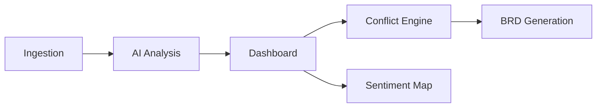

# InsightBRD+

**Intelligent Multi-Channel BRD Generation & Conflict Analytics Platform**

Built with Next.js, FastAPI, Neo4j, and PostgreSQL.

## 🚀 Features
- Multi-channel source ingestion (Gmail, Slack, Docs)
- AI-driven requirement extraction
- Knowledge Graph relationship mapping
- Conflict detection engine
- Sentiment & Priority scoring
- Editable BRD generator

## 🌐 Live Preview & Deployment

You can view the live UI/UX of InsightBRD+ without running it locally. 

### 1-Click Deployment

*Note: Deployment will only host the frontend. The backend requires additional setup for databases (PostgreSQL, Neo4j).*

### How to Preview
1. Click the **Deploy with Vercel** button above.
2. Connect your GitHub account.
3. Vercel will automatically build and host the `frontend` directory.
4. You will get a live URL to showcase the premium UI/UX!

## 🏗️ Architecture & UI Flow

---
*Created by InsightBRD+ Agent Solution*
